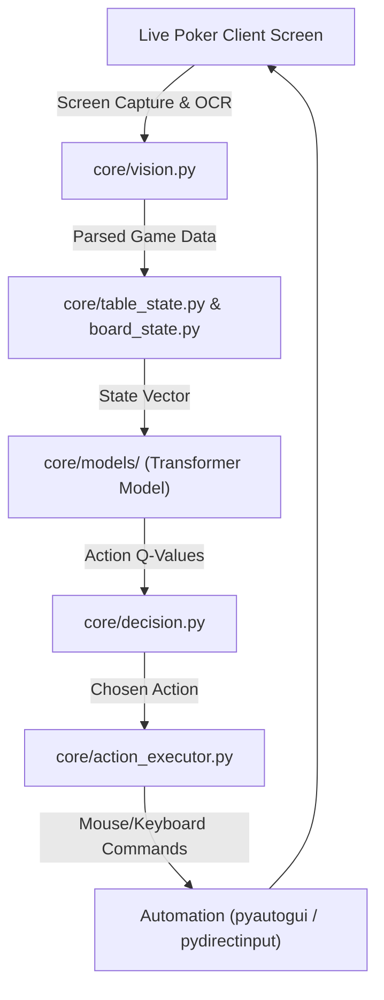
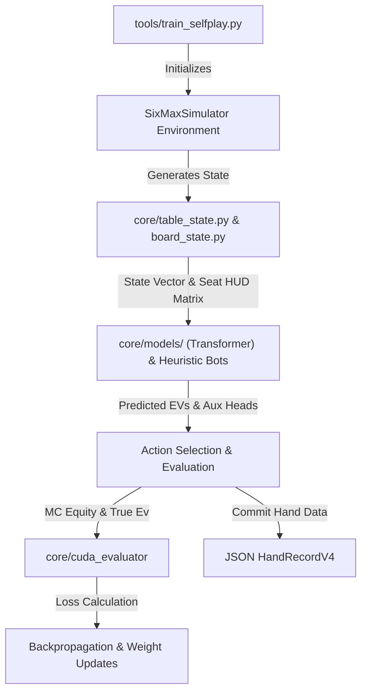

# AIPoker Architecture

This document provides a comprehensive & single source of truth, overview of the architecture for the AIPoker training and simulation environment, covering high-level design, separation of concerns, styling choices, libraries, and access restrictions.

## 1. High-Level Architecture

AIPoker is built around a self-play Reinforcement Learning (RL) pipeline capable of simulating and playing 6-Max No Limit Hold'em.
The system relies on a multi-process simulation harness (`SixMaxSimulator`) that generates training data headlessly.

Key architectural features include:
- **Transformer-based RL Models**: Utilizing Decision Transformers (e.g., Pluribus V4) running on CUDA for high-capacity state evaluations.
- **Interpretable Auxiliary Heads**: The neural networks output standard Q-values along with predictions for opponent bluff probability, opponent hand strength, and self-perceived equity (cracking open the "black box").
- **Heuristic Bootstrap Decay**: During early training phases, heuristic bots drive actions while the neural network observes and learns to map states to actions.
- **Curriculum Learning**: Staged difficulty ramping, adjusting stack sizes, active players, and seating "Fuzzy" heuristic archetypes (Maniac, Nit, TAG, Calling Station) to prevent model collapse and overfitting.
- **Computer Vision Pipeline**: Real-time screen scraping and OCR for live gameplay integration (using OpenCV and PyTesseract).

## 2. Separation Layers

The solution is divided into distinct functional layers to maintain clean boundaries between simulation, evaluation, logic, and external interfaces.

### `core/` (Core Engine & Logic)
The heart of the application containing system logic and models.
- **`bridge/`**: Contracts and interface specifications (e.g., `contract_v8_v9.py`) for component inter-communication.
- **`cuda_evaluator/`**: High-performance Monte Carlo hand evaluator written for GPU acceleration to speed up training simulations.
- **`models/`**: Neural network architectures, embeddings, and machine learning components.
- **State & Action Management**: Modules like `table_state.py`, `board_state.py`, `decision.py`, and `action_executor.py` handle hand transitions and execute the AI's chosen actions.
- **`vision.py`**: Screen capture and OCR processing logic for interpreting live poker clients.

### `tools/` (Training & Simulation Utilities)
Contains scripts designed for headless training, model evaluation, self-play execution (e.g., `train_selfplay.py`), and running diagnostics sweeps.

### `data/` & Assets (`board_samples/`, `card_templates/`, `crops/`)
Storage for pre-calculated lookup tables (e.g., `preflop_equities.csv`), captured training data, OCR template images, and visual crops used by the computer vision layer.

### `diagnostics/` & `scripts/`
Telemetry, model health evaluations, dashboard metrics, and automation scripts (like starting the training dashboard).

### `tests/`
Automated test suites for regression testing model health, mathematical holes, and system stability.

## 3. Libraries & Technologies

The codebase relies on the following key libraries:

- **Machine Learning & Math**: `torch` (implied for Transformer/CUDA ops), `xgboost`, `scikit-learn`, `numpy`, `pandas`.
- **Computer Vision & OCR**: `opencv-python`, `pytesseract`, `mss`, `Pillow`.
- **Poker Logic & Evaluation**: `treys`, `pokerkit`.
- **Automation & Input**: `pyautogui`, `pydirectinput` (for live client interaction).
- **State Management**: `transitions` (for managing table/hand state machines).
- **UI & Dashboards**: `customtkinter`.

## 4. Styling Choices

- **Code Style**: Standard Python PEP-8 for all python scripts.
- **Logging & Data**: Structured JSON logging for simulation hand records (e.g., `HandRecordV4`) to facilitate easy vectorization and metric tracking.
- **Memory & Documentation**: Utilizing Open Knowledge Format (OFK) for agent memory, maintaining Markdown-based source-of-truth documents.

## 5. Off-Limits & Critical Files

The following areas have strict access rules to prevent system instability or loss of alignment:

- **Computer Vision Bounding Boxes & Seat Centers**: **OFF-LIMITS.** Do not change bounding box coordinates or seat center templates (often found in `vision.py` or associated config files) unless explicitly granted permission by the user. 
- **`decision_rules.json`**: Handle with care; modifications can drastically impact baseline heuristic bot behaviors.
- **Simulation Source of Truth**: `.agents/skills/OFK/references/simulation_architecture.md`. If any simulation logic or environment conditions are modified outside of the simulation state, this document *must* be updated to reflect the new state. It is not to be edited casually without corresponding system changes.

## 6. Dataflow Diagrams

### Live Session Dataflow
This diagram shows the execution flow during a real-time live poker session, bypassing headless simulation and interacting directly with the client.

### Training (Headless Self-Play) Dataflow
This diagram shows the multi-process simulation and training loop, where heuristic bots and the neural network compete to generate gradient updates.

## 7. Simulation artifacts
[OFK reference](.agents\skills\OFK\references\simulation_architecture.md)

## 8. Unified Training Log (active_training.log)
All training runs, regardless of personality or model version, must output to active_training.log. The dashboard parser and HTML UI read exclusively from this file, eliminating the need to track per-personality log filenames.