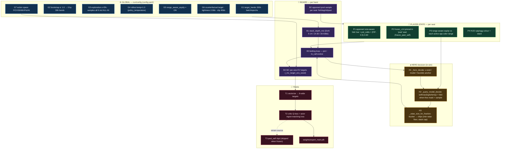
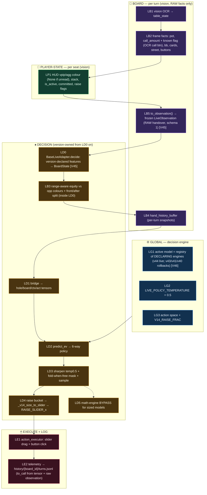
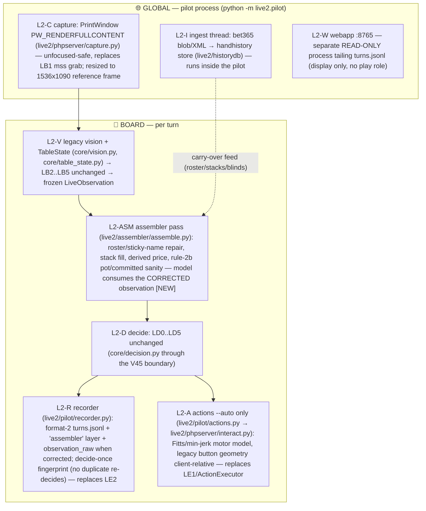

# Pipeline Flow — Simulation/Training vs Live Play

**Date Recorded**: 2026-07-15
**Related Files**: [decision.py](file:///c:/REPO/Antigravity/AIPoker/core/decision.py) · [live_observation.py](file:///c:/REPO/Antigravity/AIPoker/core/live_observation.py) · [live_adapter.py](file:///c:/REPO/Antigravity/AIPoker/core/live_adapter.py) · [action_executor.py](file:///c:/REPO/Antigravity/AIPoker/core/action_executor.py) · [PHPHelp.py](file:///c:/REPO/Antigravity/AIPoker/PHPHelp.py) · [simulator.py](file:///c:/REPO/Antigravity/AIPoker/versions/v15/self_play/simulator.py) · [train.py](file:///c:/REPO/Antigravity/AIPoker/versions/v15/self_play/train.py) · [contract.py](file:///c:/REPO/Antigravity/AIPoker/versions/v13/core/contract.py)

## Context
Two Mermaid flow diagrams that map every condition/logic/data tweak in (1) the self-play sim/training
pipeline and (2) the live-play path, colour-coded by scope (🌐 global · 🎲 board · 👤 player-state).
Boxes are ID'd so notes/commits can reference them (e.g. "changed B1", "LD4 sizing"). Complements
[simulation_architecture.md](file:///c:/REPO/Antigravity/AIPoker/.agents/skills/OFK/references/simulation_architecture.md)
and [decision-pipeline-tracing-and-gui-overrides.md](file:///c:/REPO/Antigravity/AIPoker/.agents/skills/OFK/references/decision-pipeline-tracing-and-gui-overrides.md).

## Guidelines
**MAINTAIN THIS** whenever a condition/logic/data tweak is added or changed in the sim/train pipeline
(`versions/<v>/self_play/*`) or the live path (`core/*`, `PHPHelp.py`). Current: **V44 live**
(`Herocules (v44)`); v43/v41/v40/v29 registered rollbacks. (Sim-diagram box examples still cite
V15-era values; the live diagram is current as of V45_liveHandover, 2026-07-22.)

---

## 1. Simulation & Training  (`versions/v15/self_play/`)

**Notes.** 🌐 **G1-G7** are fixed for the whole run (config.yaml): action space, exploration, the
counterfactual/tightness/clip target recipe, range-aware equity. 🎲 **B1-B4** are re-rolled every
hand — B1 samples the DoN depth, B2 fills each opponent seat, B3 runs the betting, B4 scores *every*
size counterfactually. 👤 **P1-P4** are per opponent seat: P1 is the size-aware fold response (bigger
bet → more folds), P2 pins the frozen-V14 expert, P3 feeds hero equity vs that seat's colour range.
♠ Hero acts via **H1→H2→H3** (mask + sample + size); **T1-T3** turn the hand into 6-wide targets and
weights.

---

## 2. Live Play  (`core/decision.py`, `core/action_executor.py`, `PHPHelp.py`)

> **[v49_liveRebuild, 2026-07-23] SHELL REPLACED — `live2/pilot` is now the live runtime.**
> PHPHelp.py is RETIRED as the driver. The LG/LB/LD/LP boxes below are UNCHANGED — the pilot
> calls the same `core/` code across the same V45 boundary — but the shell boxes (capture,
> price OCR orchestration, recorder, executor) moved: see **§2b live2 pilot** for the current
> outer loop and what replaced LB1 (mss monitor grab → PrintWindow) and the LP boxes
> (ActionExecutor → phpserver motor model). New box between LB5 and LD0: **L2-ASM**, the
> assembler correction pass — the model now consumes the CORRECTED observation.

**Notes.** 🌐 **LG1-LG3** are engine constants: which model is active and the serve temperature/action
space (must mirror the training recipe — G4/G7). 🎲 **LB1-LB4** rebuild each turn from vision: LB2's
`call_amount` is OCR'd off the Call button, LB3 recomputes range-aware equity (mirrors P3), LB4 keeps
the per-turn snapshot sequence the model reads. 👤 **LP1** is the per-seat HUD/stack read that feeds
LB3. ♠ **LD1-LD5** mirror the sim's H2/H3 exactly (mask + sample + slider sizing; math engine bypassed)
so train≡serve; **LE1** drags the slider then clicks, **LE2** logs the turn for review/F12.

---

## 2b. Live Play, current shell — live2 pilot  (`live2/pilot/`, 2026-07-23)

One headless process replaces the PHPHelp GUI. Inner LG/LB/LD boxes from §2 are reused verbatim
(same `core/` code, same V45 boundary); only the shell is new. IDs **L2-x**:

**Retired from the live path**: PHPHelp.py (whole GUI shell), core/action_executor.py (superseded by
the motor model), `live2.assembler --watch` (pilot embeds the assembler — NEVER run both), PHPserver
:8766 WS server (idle; pilot imports its capture/interact modules in-process).
**New invariant**: L2-ASM corrections happen BEFORE the V45 boundary, so record `observation` =
what the model consumed; raw vision survives as `observation_raw`.

---

### Train ≡ Serve invariants (must stay paired across both diagrams)
- Sampling temperature: **G4** (rollout 1.0) ↔ **LD3/LG2** (serve 0.5) — eval must match serve temp.
- Fold-when-free mask: **H2** ↔ **LD3**.  · Raise sizing: **H3** (`_raise_size_for_fraction`) ↔ **LD4** (`_v14_size_to_slider`).
- Range-aware equity: **P3** ↔ **LB3** (same `compute_range_aware_equity`).  · Action space: **G7** ↔ **LG3**.
- Chip-identity collapse [V47 all-in-only → **V48 generalized**]: **H3**'s training-side grouping
  (simulator `collapse_by_chips_all` — any sized raises resolving to identical chips share ONE
  canonical action, EV copied, duplicates regret-masked) ↔ **LD3**'s serve mirror in
  `core/decision.py` (gated on the engine's `collapse_aliased_buckets`; V47's narrower
  `collapse_aliased_allin` remains for that engine). Both sides must group by the same
  resolved-chips rule or serve re-splits probability mass training merged.

### [V42_liveFixes, 2026-07-21] Live-path corrections — what changed in LB2/LB3/LP1/LD3

- **LB3's equity implementation is now chosen by the VERSION, not by PHPHelp.** It used to walk a
  per-version substring ladder inside `PHPHelp.py` that stopped at `'v29'`, so V40 and V41 were
  served **vs-random** equity and a constant `hand_strength=0.5` while live — the P3↔LB3 invariant
  above, silently broken by a deployment that touched no invariant-related code. The engine now
  declares `live_features()` and `core/decision.py::live_feature_providers()` resolves it; an
  unresolved model is logged as an ERROR instead of degrading. **When adding a version, give its
  engine `make_bridge()` AND `live_features()` — then no ladder can forget it.**
- **LB2's `call_amount` is no longer 0-on-failure.** An unreadable Call button used to read as
  "free check", which LD3's fold-when-free mask turned into *FOLD is illegal*. `make_decision` now
  takes `call_amount_known`; LD3 masks FOLD only on a positively identified free check. Units are
  digit-stripped to match vision (decimal-stake tables were 100× off), and the fabricated 2.0/100.0
  chip constants are gone. LD3 also masks **CALL** when the Call button is absent (it previously
  accepted `check_call_available` and ignored it, so LE1 could click a button that wasn't there).
- **LP1's unknown-HUD default is Yellow/Green, not Blue** — matching training's absent-profile
  default (0.30/0.46) instead of encoding an unclassified opponent as the tightest possible nit.
- **LB2's positions are counted over the OCCUPIED ring**, so 3–5 handed DoN endgames no longer
  encode hero as UTG when hero is the BB. Opponents are written into the contract slot whose
  derived position equals their true one — identity mapping at a full table.
- **LB2 refuses to build a 1–2 card board state** (the contract aliased it to River).

Details and measured before/after: `versions/v42_liveFixes/SPECS.md`.

### [V45_liveHandover, 2026-07-22] The live↔model boundary — LB5/LD0 added, LB3 moved inside LD0

- **LB5 (`TableState.to_observation()`)** now ends the live layer's responsibility: a frozen,
  JSON-serializable `LiveObservation` of RAW facts only (raw chips, `None` sentinels for unread
  values, occupied-ring positions, per-seat committed/raise flags, `call_amount` + `known`,
  button availability). Rules in `core/live_observation.py`: raw-facts-only, None-sentinels,
  append-only schema.
- **LD0 (`BaseLiveAdapter.decide`, `core/live_adapter.py`)** is where the ACTIVE VERSION's own
  interpretation begins: range-aware equity with the front/after split (LB3 now lives here as a
  pure function, `classify_front_after`), `hand_strength`, `effective_field` (V44+), and
  BoardState assembly — all resolved from the engine's own `live_features()` declaration.
  `PHPHelp.py` holds **zero per-version logic on the decision path**; it renders the
  `LiveDecision` diagnostics instead of recomputing them. Engines may declare
  `make_live_adapter()` for a custom pipeline.
- **LE2** additionally records the raw observation (additive `"observation"` key in turns.jsonl),
  so any recorded turn replays offline through any version's adapter.
- The P3↔LB3 invariant is unchanged in substance (same `compute_range_aware_equity` per version)
  — what changed is WHERE the live half runs (inside LD0, version-owned) so a new version can
  never be silently served the wrong estimator (the V42 founding bug class).
- Parity-verified byte-identical vs the pre-refactor path:
  `versions/v45_liveHandover/verify_handover.py` (14/14) + the V42 suites re-run green. See
  `versions/v45_liveHandover/SPECS.md`.

### [v46_legacySweep, 2026-07-22] Legacy dispatch deleted — LG1/LD1 are declaration-only now

Pre-v30 versions are LEGACY by user decision. `core/decision.py`'s `is_vN` ladders, per-version
bridge chain, `_LEGACY_LIVE_FEATURES` name-ladder, display-tag ternary, v9 river guardrail and
the math/bluff/preflop-chart override layers (with their `use_*` kwargs and PHPHelp toggle vars)
are DELETED; the 3-way actor path too. LD1's bridge and LB3's feature implementations resolve
ONLY from engine declarations; an engine without them refuses loudly. Registry = v44/v43/v41/v40.
`tools/self_play` (pre-`versions/` stack) → `attic/`. Verified
`versions/v46_legacySweep/verify_legacy_sweep.py` 31/31 + the full suite battery green; see
`versions/v46_legacySweep/SPECS.md`.

### [V47, 2026-07-22] Opponent-behavior realism + target alignment — H3-side changes, one NEW invariant pair

Simulation-side (versions/v47 only, defaults ON in `SixMaxSimulator.__init__`):
- **B-side (opponent execution)**: opponent raises are no longer a fixed `0.75×pot` — NN seats
  execute the `raise_k` bucket they chose, TreeOpponents their predicted size class, heuristics
  sample per-archetype `RAISE_SIZE_DISTRIBUTIONS` (opponent_bots.py, C1-calibrated). All sizes
  flow through the same **H3** `_raise_size_for_fraction` (min-raise floor / reopen rules).
- **T-side (targets)**: `_mc_target_evs_sized` fold-outs are OCCUPANT-TRUE ([M4]) — NN seats via a
  batched policy pass on hypothetical post-raise states, Tree seats via class probs, heuristics
  via the analytic closed form (kills the 10-roll L4 quantization noise). `allin_by_chips` is
  adopted ([M9]): chip-identical clamped buckets get ALLIN semantics + the canonical ALLIN
  bucket's exact EV, and their actor-target regret is masked to zero.

**NEW Train ≡ Serve invariant pair (add to the list above):**
- Aliased-bucket collapse: **T-side** (`allin_aliased` flags → `regret_match_policy*` masks in
  train.py) ↔ **LD3** (decision.py sampler masks chip-identical raise buckets when the engine
  declares `collapse_aliased_allin=True`; declared ONLY by v47_engine — engines trained without
  the collapse must not declare it).

Curriculum: stack_depth_mix gains [2,5]+[5,8] bands ([VAL-1(A)]). Training loop: cosine T_max =
real batch count, checkpoints carry optimizer+scheduler state (--resume_path restores both,
[VAL-5]), validation is a held-out worker stream ([M6]). Verified:
`versions/v47/self_play/verify_v47.py` 28/28 + `calibrate_raise_sizes.py` C1/C2 OK.
v47_engine.py exists but is NOT registered — deploy is one registry line after the
versions/v47/SPECS.md acceptance gates pass.
