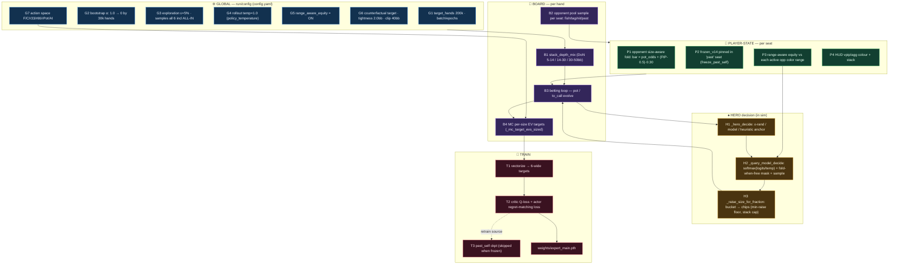
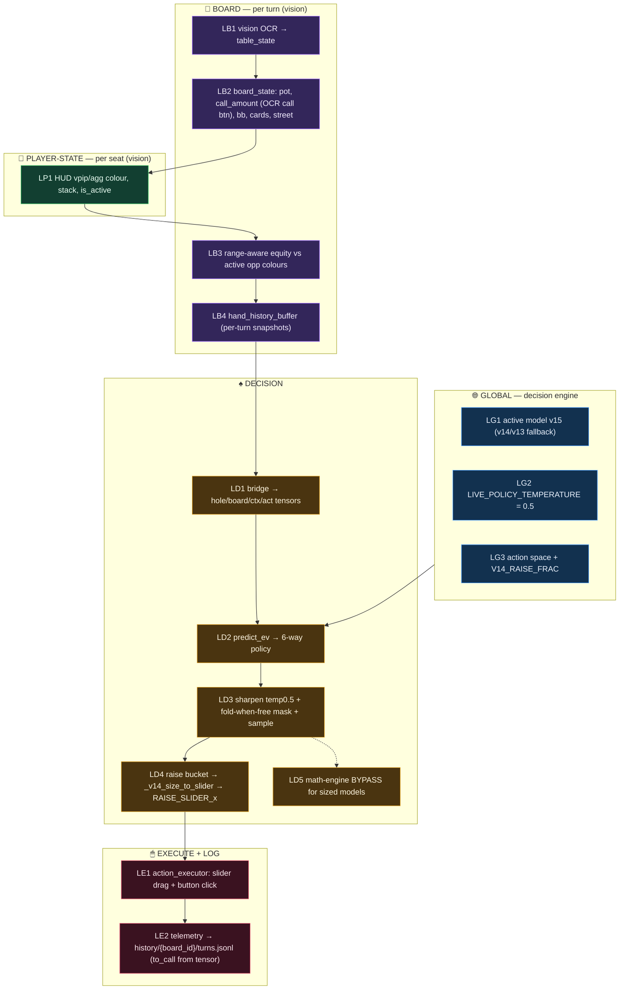

# Pipeline Flow — Simulation/Training vs Live Play

**Date Recorded**: 2026-07-15
**Related Files**: [decision.py](file:///c:/REPO/Antigravity/AIPoker/core/decision.py) · [action_executor.py](file:///c:/REPO/Antigravity/AIPoker/core/action_executor.py) · [PHPHelp.py](file:///c:/REPO/Antigravity/AIPoker/PHPHelp.py) · [simulator.py](file:///c:/REPO/Antigravity/AIPoker/versions/v15/self_play/simulator.py) · [train.py](file:///c:/REPO/Antigravity/AIPoker/versions/v15/self_play/train.py) · [contract.py](file:///c:/REPO/Antigravity/AIPoker/versions/v13/core/contract.py)

## Context
Two Mermaid flow diagrams that map every condition/logic/data tweak in (1) the self-play sim/training
pipeline and (2) the live-play path, colour-coded by scope (🌐 global · 🎲 board · 👤 player-state).
Boxes are ID'd so notes/commits can reference them (e.g. "changed B1", "LD4 sizing"). Complements
[simulation_architecture.md](file:///c:/REPO/Antigravity/AIPoker/.agents/skills/OFK/references/simulation_architecture.md)
and [decision-pipeline-tracing-and-gui-overrides.md](file:///c:/REPO/Antigravity/AIPoker/.agents/skills/OFK/references/decision-pipeline-tracing-and-gui-overrides.md).

## Guidelines
**MAINTAIN THIS** whenever a condition/logic/data tweak is added or changed in the sim/train pipeline
(`versions/<v>/self_play/*`) or the live path (`core/*`, `PHPHelp.py`). Current: **V15 live**
(`Herocules (v15 DoN)`); v14/v13 fallbacks. Open tweaks tracked in `versions/v16/SPECS.md`.

---

## 1. Simulation & Training  (`versions/v15/self_play/`)

**Notes.** 🌐 **G1-G7** are fixed for the whole run (config.yaml): action space, exploration, the
counterfactual/tightness/clip target recipe, range-aware equity. 🎲 **B1-B4** are re-rolled every
hand — B1 samples the DoN depth, B2 fills each opponent seat, B3 runs the betting, B4 scores *every*
size counterfactually. 👤 **P1-P4** are per opponent seat: P1 is the size-aware fold response (bigger
bet → more folds), P2 pins the frozen-V14 expert, P3 feeds hero equity vs that seat's colour range.
♠ Hero acts via **H1→H2→H3** (mask + sample + size); **T1-T3** turn the hand into 6-wide targets and
weights.

---

## 2. Live Play  (`core/decision.py`, `core/action_executor.py`, `PHPHelp.py`)

**Notes.** 🌐 **LG1-LG3** are engine constants: which model is active and the serve temperature/action
space (must mirror the training recipe — G4/G7). 🎲 **LB1-LB4** rebuild each turn from vision: LB2's
`call_amount` is OCR'd off the Call button, LB3 recomputes range-aware equity (mirrors P3), LB4 keeps
the per-turn snapshot sequence the model reads. 👤 **LP1** is the per-seat HUD/stack read that feeds
LB3. ♠ **LD1-LD5** mirror the sim's H2/H3 exactly (mask + sample + slider sizing; math engine bypassed)
so train≡serve; **LE1** drags the slider then clicks, **LE2** logs the turn for review/F12.

---

### Train ≡ Serve invariants (must stay paired across both diagrams)
- Sampling temperature: **G4** (rollout 1.0) ↔ **LD3/LG2** (serve 0.5) — eval must match serve temp.
- Fold-when-free mask: **H2** ↔ **LD3**.  · Raise sizing: **H3** (`_raise_size_for_fraction`) ↔ **LD4** (`_v14_size_to_slider`).
- Range-aware equity: **P3** ↔ **LB3** (same `compute_range_aware_equity`).  · Action space: **G7** ↔ **LG3**.
